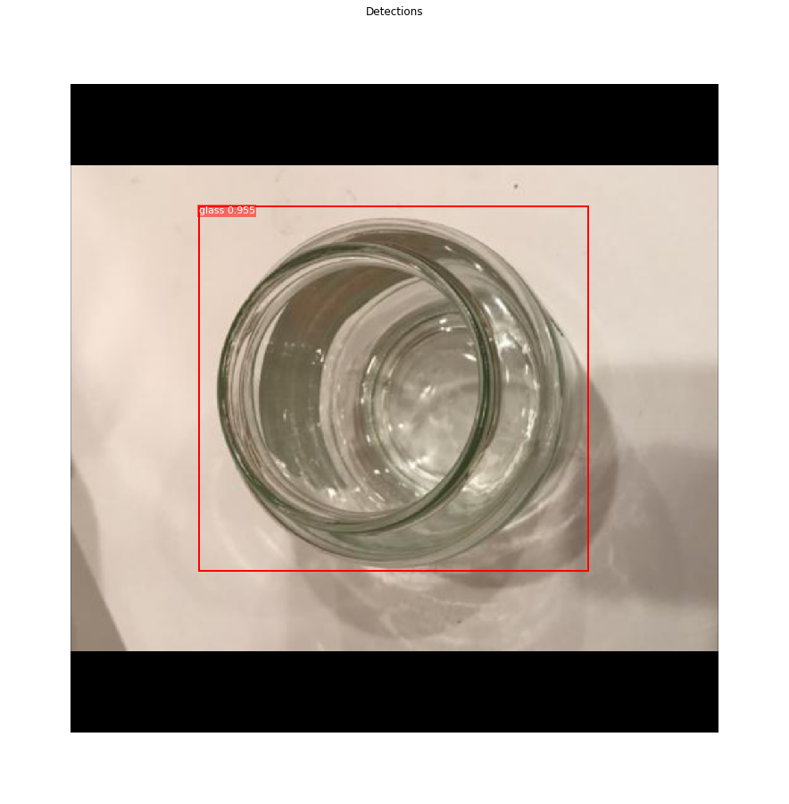

# wastedata-multiple-classes
This Repo is just a tiny modification of Matterports MaskRCNN Repo link is [here](https://github.com/matterport/Mask_RCNN), the reason why i didnt fork the original one is because re-uploading the necessary modified part is much easier and cleaner to go through.

Instance segmenting more than 2 classes in an image,where image dataset is from publicly available data, for annotation we are using VGG annotator latest version

  Here we defined 4 classes :<ul>
  <li>bottle</li>
  <li>glass</li>
  <li>paper</li>
  <li>trash</li>
</ul>
  
  
Below are the examples for model's accuracy
<h1>Bottle</h1>

<h1>Glass</h1>

<h1>Trash</h1>

<h1>Four in one</h1>
This is the collage of four classes in one picture, and the prediction result

Since we just tweaked a bit on original code of matter port's mask-rcnn, it do has all the step by step detection

<h1>Color splash</h1>

<h1>Anchor sorting and filtering</h1>

<h1>Bounding box</h1>

<h1>Mask Generation</h1>

<h3># Train a new model starting from pre-trained COCO weights</h3>
        python final.py train --dataset=/path/to/datasetfolder --weights=coco

<h3># Resume training a model that you had trained earlier</h3>
        python final.py train --dataset=/path/to/datasetfolder --weights=last

